# **Group 14 Analysis on the Premier League Data from 2014-2020**

## **Team Members**
- Takara Nishizaki
- Omar Hemed
- Makoto Kitamura

## **Introduction**

The Premier League is one of the most famous football leagues in the world, known for its high intensity and level of players. The three of us; Takara Nishizaki, Omar Hemed, and Makoto Kitamura analyzed the Premier League games between 2014-2020 (The original data can be accessed from [here](https://www.kaggle.com/datasets/sanjeetsinghnaik/premier-league-matches-20142020) ) from various perspectives, to see if there is a strong correlation between certain factors. The data from the Premier League was chosen because all three of us have an interest in football, and wanted to analyze statistical data that we are interested in while having some prior knowledge as well. Through the various categories and factors that are in the game of football, we came up with three research questions that can be answered to analyze the game further from a statistical viewpoint. 

## **Exploratory Data Analysis**
- We have used various different plots to explain each research question in its own unique way.
- We have focused on grouping items to have a clearer visual, such as grouping by years or teams.
- The dataset was wrangled so that only the necessary columns exist, while a few columns were added to further expand on the research.

## **Research 1: Does playing at home affects the amount of yellow/red cards for the away team? (Omar Hemed)** 

- The analysis notebook can be accessed from [here](https://github.com/ubco-W2022T2-data301/Group14/blob/main/analysis/analysis1.ipynb)

The main focus of my research question was to gather as much data as I could for the yellow and red cards for the away team and compare them with the home team. I gathered the information for both yellow and red cards and calculated them per year, I also got the mean of all teams and the mean for yellow and red cards. After getting into more depth about my question I concluded that the away team gets more yellow/red cards for multiple reasons. One of the reasons is that the away team is not playing with its own fans and field and that affects the players and how well they can perform in a match.

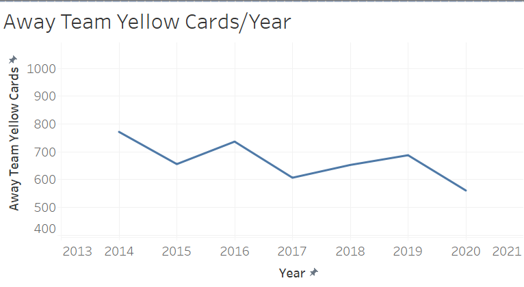

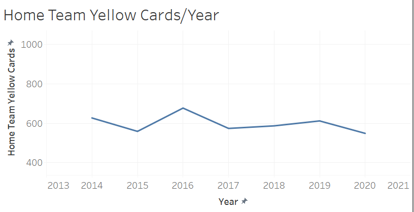

I specifically chose to add the 2 graphs above to my dashboard since they are easy to read and convenient. As represented above we can see the number of yellow cards per year for both the home team and the away team. This is an easy visualization that can clearly show us the huge difference between the number of yellow cards the away team gets over the home team.

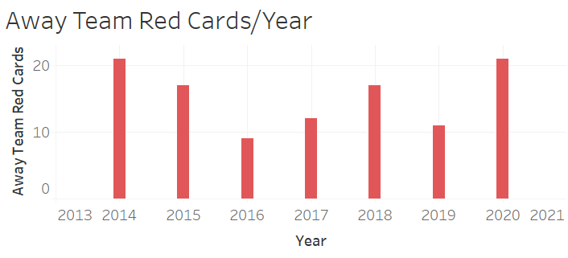

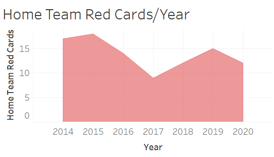

Moreover, I presented 2 graphs for red cards per year for both the home and the away team. It was a little bit harder to gather information about red cards since they are rare to happen. We can observe from these 2 graphs that still the away team gets more red cards than the home team over the years. And that concludes my research question that the away team gets more yellow and red cards than the home team for many different reasons.

## **Research 2:  How does the halftime score affect the result and excitement of the whole game? How does a score of the home game change the excitement of the fans and does having higher excitement affect even more goals for the home team? What other strong factors are contributing to the team winning the game? (Makoto Kitamura)**

- The analysis notebook can be accessed from [here](https://github.com/ubco-W2022T2-data301/Group14/blob/main/analysis/analysis2.ipynb)

My research was focused on exploring the impact of halftime scores and home game excitement on the overall result and excitement of a soccer match. Specifically, I was interested in understanding how a team’s halftime lead or deficit could affect their performance in the second half, and how the excitement of home fans could potentially influence the outcome of the game. While I found that these factors can have some impact, I also noted that there are many other factors that contribute to a team's success, such as player skill coaching tactics, and external factors like injuries or weather conditions. Overall my research highlights the complex and multifaceted nature of soccer as a sport and the many variables that can influence the outcome of a match.

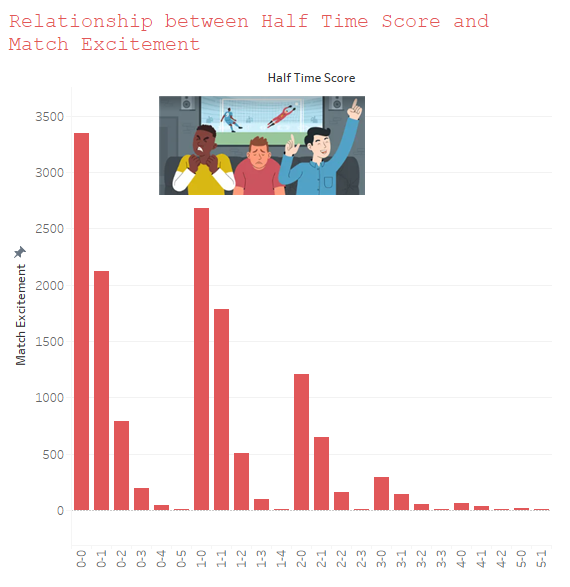

This graph reveals that matches with close scores, such as 0-0, 1-1, and 1-0 have the highest match excitement for the fans. This indicates that fans enjoy matches that are competitive and where the outcome is uncertain until the very end. It also suggests that a low-scoring match can be just as exciting, if not more so, than a high-scoring match.

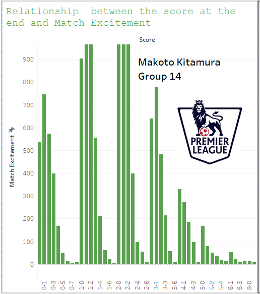

After analyzing the relationship between the final score and the match excitement, I found that the graph looks similar to the halftime score bs match excitement. Interestingly, this indicates that there was no clear correlation between the two graphs. This suggests that the level of match excitement at halftime may not necessarily be a good predictor of the final score.
As you can see, even if the final score is high, there can be a decrease in overall match excitement in the latter stages of the game.

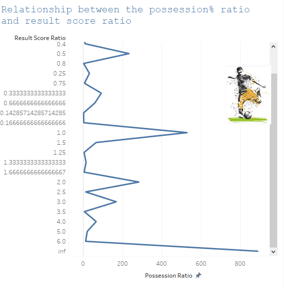

I found from the last graph that there is a strong correlation between the possession ratio and the result score ratio. This suggests that the team with more possession tends to have a higher result score ratio. Result score ratio is calculated by dividing the home team’s result score by the awy team’s result score. Ratio inf(infinity) indicates that away team did not score any(divide by zero).

From my analysis of the last graph, I found a strong correlation between possession ratio and result score ratio. This indicates that the team with more possession tends to have a higher result score ratio. Result score ratio is a metric I used to calculate the home team’s result score divided by the away team’s result score. If the away team did not score any goals, the ratio is undefined(indicated by infinity). 
This finding suggests that possession is an important factor indetermining the outcome of a match. Teams that are able to maintain possession of the ball for longer periods of time are more likely to create scoringopportunities and control the pace of the game. Additionally, possession can help to tire out the opposing team and limit their attacking opportunities.

## **Research 3:  How do cards affect the excitement of the fans watching the game in the stadium? Do more fouls lead to more cards? (Takara Nishizaki)**

- The analysis notebook can be accessed from [here](https://github.com/ubco-W2022T2-data301/Group14/blob/main/analysis/analysis3.ipynb)

For my research question, I wanted to focus on the relationship between the number of cards, and the rate of match excitement given out by the fans. I was curious about this because some people enjoy the game more when it gets heated with all of the aggressive and intense duals that are performed on the field. Therefore, I decided to make different tables that compare three categories from the dataset that we chose to work on. They are the Match Excitement, Fouls, and Yellow Cards categories. To conduct this, I wrangled the dataset into categories that are only necessary for my research, which are the Teams, Score, Match Excitement scale, and Yellow/Red cards. In addition to that, I have made three new columns that combine the sum of yellow/red cards and fouls, since those categories were separated into Home and Away. Finally, I made two new columns that categorize the number of fouls and yellow cards, so that it will be easier to see when I plot the graph later on in my research. 

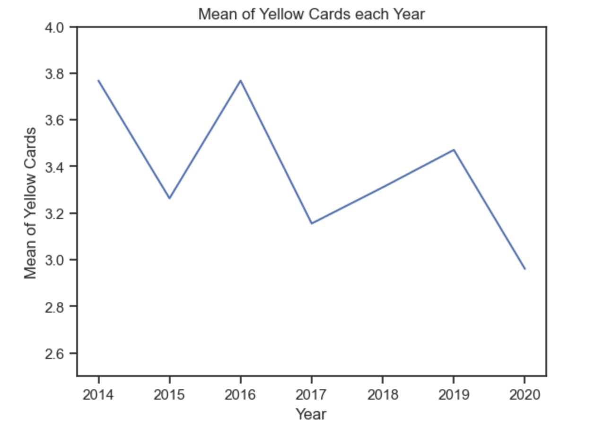

First, I took the mean of yellow cards per year, using the groupby function. Here, we can see that the average number of yellow cards per game is approximately 3 to 4, and shows no significant change over the years. Usually, the league implements new rules and refereeing standards that change how the referees judge the game. However, we can see that it is not a significant factor that might affect the research.

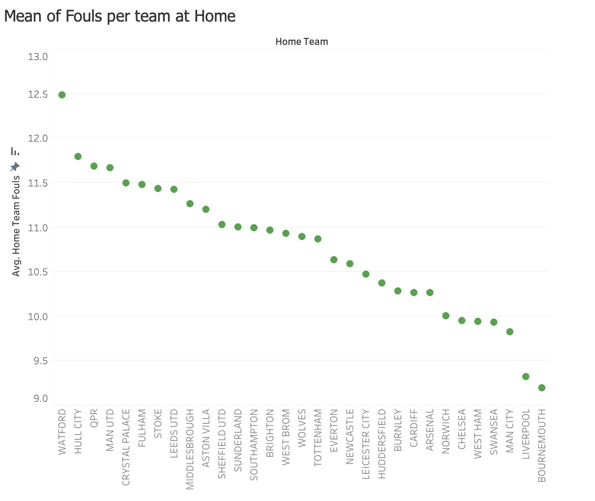

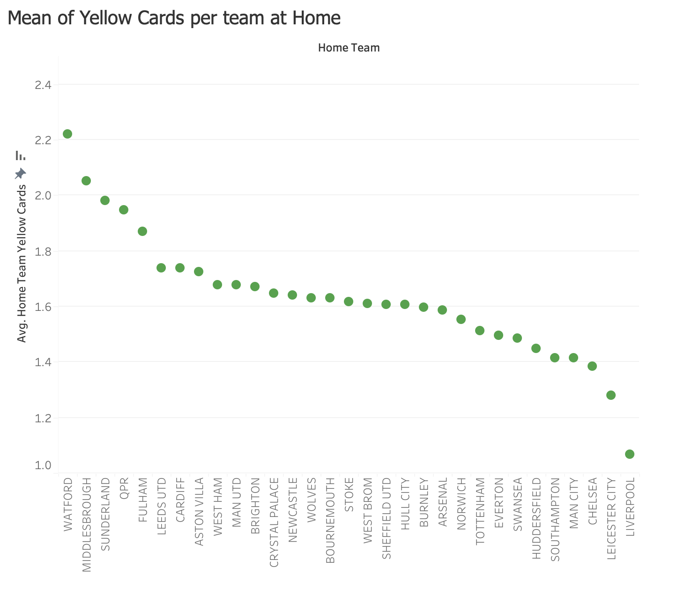

Next, I made two graphs that show the average number of cards that each team receives, and the number of fouls they commit when playing at home. The purpose of these two graphs was to see if more fouls committed will lead to more yellow cards given out as a penalty. When looking at the mean number of fouls, Watford has the highest number of fouls committed, while Liverpool has the second least number of fouls committed. With this information, looking at the mean number of yellow cards per team, Watford is also the highest in this category, and Liverpool is the team with the least cards given out. Therefore, we are able to see the correlation where more fouls lead to more yellow cards given out. The reason behind this is probably to keep the game away from getting too heated and to protect the players before getting into situations where they could get injured.

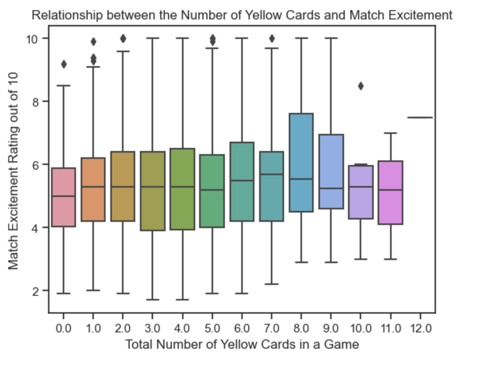
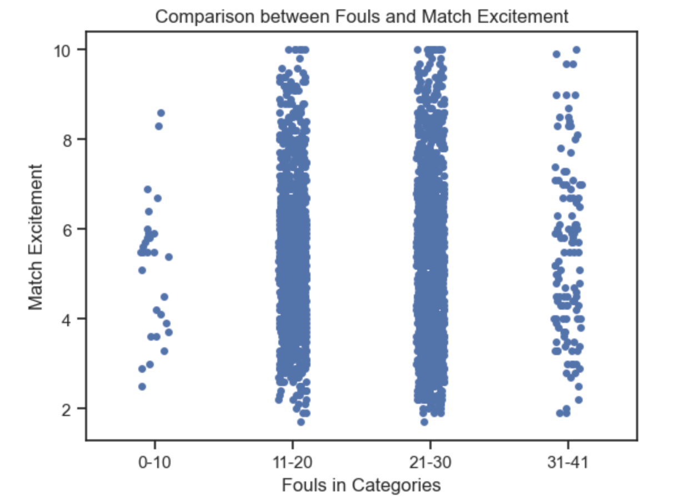

Finally, to see the correlation between the match excitement and the number of fouls, I created a box plot along with a swarm plot. The box plot shows the relationship between the number of yellow cards and their match excitement. Here, it can be said that there is no significant evidence that more yellow cards will lead to fans being more excited. In fact, there are some outliers that show a high match excitement rate when having a few yellow cards. Next, the swarm plot shows the relationship between the number of fouls (which was categorized), and the match excitement rate. In the previous two graphs, there was a correlation between the number of yellow cards and fouls, so I decided to include this swarm plot. Here, it is similar to the previous box plot where no significant correlation was seen between the two, since the match excitement rate was spread out from 2-10, regardless of the number of fouls.

To conclude my individual research, I was not able to obtain significant evidence that the number of yellow cards increases the match excitement rate. The reason behind this may be that the fans want to watch their team win, regardless of how the team performs. In addition to that, each team has different playing styles that will make a difference in the number of fouls and yellow cards received. To answer the second part of the research question, more fouls do lead to more yellow cards, as shown by the previous graphs where there was a correlation between the two categories. Since football is a sport where a lot of different factors are involved, it was hard to say that one specific factor determines the match excitement rate. 

## **Conclusion**

It is interesting to see how some of the data show certain tendencies between categories, and how the playing style of the team can lead to different intensities, scores,  and penalization in the game. The biggest lesson from this research was that there are 22 players playing on the field at a time, while the coaches are making different decisions on the spot. With all of the different thoughts, perspectives, and emotions that can happen in the span of 90 minutes, it is hard to make a significant connection between data, as there are no guarantees in football. Yellow cards happen more often than red cards, and away teams can be more aggressive than the home team. Thre is a slight advantage for the home team because of the support from their fans. More fouls lead to more cards, as referees are trying to keep the game from getting out of hand. Finally, all of the analysis that was done during this project is a fact. However, the game of football is so much more than just a series of numbers and data. This research will definitely benefit to look at tendencies, but will not guarantee any results and outcome of the game, hence why people enjoy the game. 